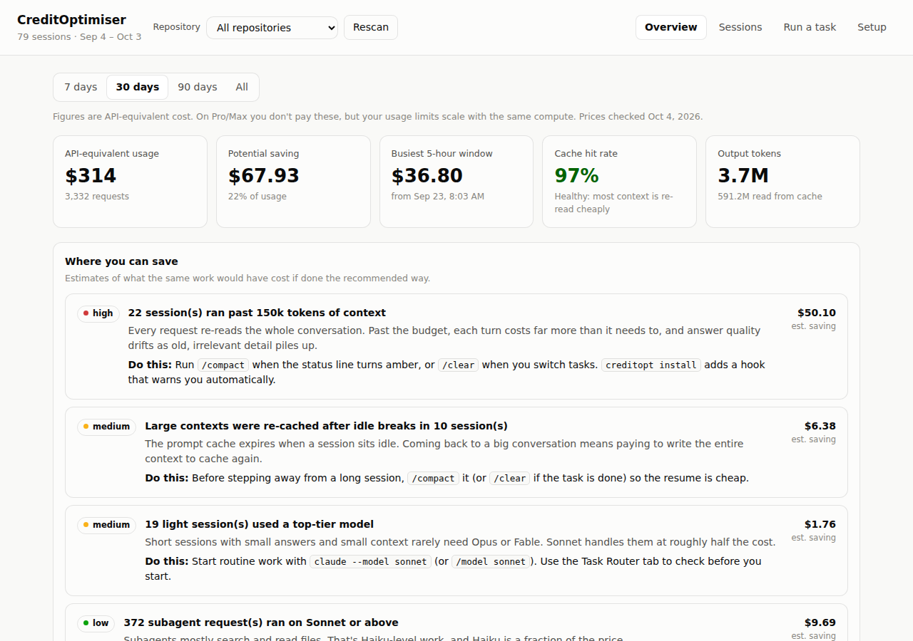
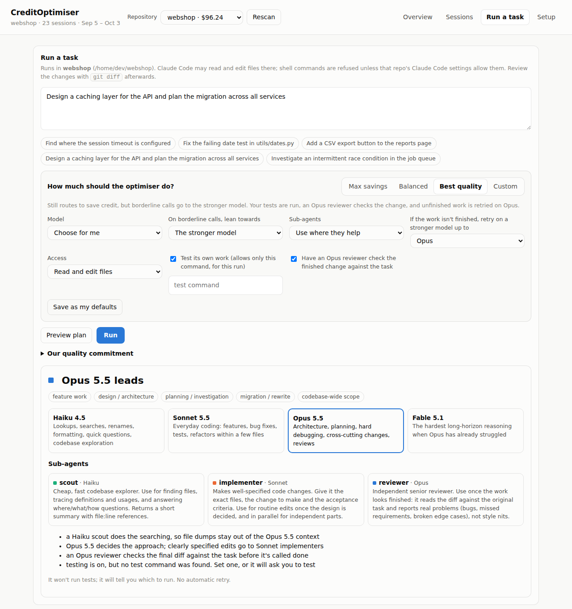
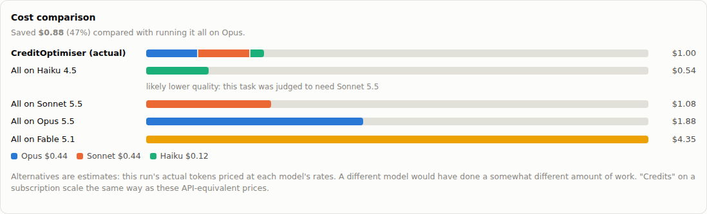

# CreditOptimiser

**Get more out of your Claude subscription.** CreditOptimiser shows where your Claude Code usage
goes. It runs each task on the cheapest setup that will still do it well, and tells you when to
`/compact` or `/clear`. It works on macOS, Linux and Windows.

> **Unofficial tool.** CreditOptimiser is an independent project. It is not made, endorsed or
> supported by Anthropic. "Claude" and "Claude Code" are Anthropic's products.
>
> **Individual experiences may vary.** Savings and cost figures are estimates. How much you
> save depends on your tasks, your repositories and how you work.

---

## What it does

- **Usage dashboard.** See your Claude Code usage by day, model, project and session, your
  busiest 5-hour window, and how well your prompt cache is working.
- **Where you're wasting credit.** It lists ranked, specific fixes, each with an estimated
  saving: sessions that ran too long without compacting, expensive models used for light work,
  big contexts re-loaded after a break, and so on.
- **Run tasks on the right model.** Describe a task, pick a repository and press **Run**:
  - It picks the cheapest model likely to do the task *well* (Haiku, Sonnet, Opus or Fable).
  - It adds sub-agents where they save money, such as cheap helpers for searching and testing.
  - It can run your tests and have an Opus reviewer check the result.
- **See what you saved.** After each task, a chart compares what it cost with what the same
  work would have cost on each model alone.
- **Nudges inside Claude Code** (optional add-ons):
  - a context meter in the status line
  - a warning before your context gets expensive
  - a suggestion to switch model when a trivial prompt is about to go to Opus

Everything runs on your own computer. Nothing is uploaded, and there are no third-party
dependencies.



<details>
<summary>More screenshots</summary>

**Running a task:** the plan, with the chosen model and sub-agents



**After a task:** what it cost compared with each model alone



*Screenshots use the built-in sample data (`--demo`).*
</details>

## What you need

- **Claude Code**, installed and logged in. CreditOptimiser works with Claude Code only, not
  the claude.ai website or apps.
- **Python 3.9 or newer.**
- **Git**, to download CreditOptimiser.
- A **web browser**.

| | Status |
|---|---|
| macOS | Used day to day by the author |
| Linux | Tested during development |
| Windows | Passes the automated tests on Windows. Real-world feedback is very welcome; please [open an issue](https://github.com/tradelynx/CreditOptimiser/issues) if anything misbehaves |

## Install

### macOS

1. Open **Terminal** (Applications → Utilities).
2. Check you have Python and Git:
   ```bash
   python3 --version
   git --version
   ```
   If your Mac offers to install the "command line developer tools", accept, then run the
   commands again.
3. Download CreditOptimiser:
   ```bash
   cd ~
   git clone https://github.com/tradelynx/CreditOptimiser.git
   cd CreditOptimiser
   ```

### Linux

1. Open a terminal.
2. Make sure Python 3 and Git are installed. On Debian/Ubuntu:
   `sudo apt install python3 git`. On Fedora: `sudo dnf install python3 git`.
3. Download CreditOptimiser:
   ```bash
   cd ~
   git clone https://github.com/tradelynx/CreditOptimiser.git
   cd CreditOptimiser
   ```

### Windows

1. Install **Python** from [python.org](https://www.python.org/downloads/windows/) and tick
   **"Add python.exe to PATH"** in the installer. Or, in PowerShell, run:
   `winget install Python.Python.3.13`
2. Install **Git for Windows** from [git-scm.com](https://git-scm.com/downloads/win). Claude
   Code uses it too.
3. Open **PowerShell** and download CreditOptimiser:
   ```powershell
   cd ~
   git clone https://github.com/tradelynx/CreditOptimiser.git
   cd CreditOptimiser
   ```

> On Windows, type `python` wherever this guide says `python3`. If `python` isn't found, try `py`.

## Start the dashboard

From the `CreditOptimiser` folder:

```bash
python3 -m creditopt serve
```

Your browser opens the dashboard at http://127.0.0.1:8765. Keep the terminal window open
while you use it; press **Ctrl+C** in it to stop.

- **Try it with sample data first:** `python3 -m creditopt serve --demo`
- **Open it on one repository:** `python3 -m creditopt serve --repo ~/path/to/your/repo`

> Always run `python3 -m creditopt …` from inside the `CreditOptimiser` folder. If you see
> "No module named creditopt", you're in a different folder.

## Using it

### Pick a repository

The **Repository** dropdown at the top lists the folders you've used Claude Code in, then
every other git repository on your computer. It scans your home folder 4 levels deep; change
that under **Setup → Settings**, or click **Rescan** after cloning something new. Picking a
repository filters the dashboard to it and makes it the place where tasks run.

### Overview and Sessions

- **Overview:** your usage, savings opportunities with specific fixes, daily usage by model,
  and top projects.
- **Sessions:** every Claude Code session, with a meter showing how large its context got
  compared with your compact budget.

### Run a task

Describe what you want done, press **Preview plan** to see what it will do and why, then
press **Run**. Progress streams in live. You can switch tabs or reload the page; the run
carries on, and the page reconnects to it.

**Choose how much the optimiser does for you.** Pick a preset, or change any single setting:

| | Max savings | Balanced | Best quality (default) |
|---|---|---|---|
| Borderline model choices lean to | the cheaper model | neither | the stronger model |
| Sub-agents | where they help | where they help | where they help |
| Runs your tests to check its work | no | yes | yes |
| Opus reviewer checks the finished change | no | no | yes (skipped for small mechanical tasks) |
| Unfinished work is retried on a stronger model, up to | no retry | Opus | Opus |

You can also fix the model, turn sub-agents off or pick them by hand, set your own test
command, allow retries up to Fable, or use read-only **plan** mode. **Save as my defaults**
remembers your choice.

**Sub-agents it may use:**
- **scout** (Haiku) does the searching, so file dumps don't fill the expensive model's context.
- **implementer** (Sonnet) makes clearly specified edits when Opus is leading, at half the price.
- **verifier** (Haiku) runs your tests.
- **reviewer** (Opus) reads the finished diff against your request.

**What a run is allowed to do:**
- It can read and edit files in the chosen repository, so review the changes with `git diff`.
  Working on a new branch is a good habit.
- Other shell commands are refused, unless your repository's own Claude Code settings allow them.
- With testing on, only your test command is allowed (plus `git diff`/`git status` for the
  reviewer), and only for that run.

**Every run ends with an honest status:** *done* (finished and checked), *done, not tested*
(finished, with the checks you should run), or *incomplete*.

**Cost comparison.** When a run finishes, a chart shows what it actually cost next to what the
same work would have cost on each model alone, for example:

```
▶ CreditOptimiser (actual)   $0.26
  All on Haiku 4.5           $0.17  likely lower quality: this task was judged to need Sonnet 5.5
  All on Sonnet 5.5          $0.34
  All on Opus 5.5            $0.61
  All on Fable 5.1           $1.42
Saved $0.35 (57%) compared with running it all on Opus.
```

The alternatives are estimates: the run's real token usage priced at each model's rates.
Another model would have done a somewhat different amount of work, so treat them as a guide.

### Our quality commitment

CreditOptimiser saves credit by cutting waste, never corners.
- It picks the cheapest model that will do the task **well**. On Best quality, borderline
  calls go to the stronger model.
- The savings come from cheap helpers doing the searching, cheaper models doing routine
  edits, and clearing stale context. The model doing the thinking keeps its full ability,
  and every run is told to do the task properly, not to economise on tokens.
- When you allow it, the work is checked: your tests are run and an Opus reviewer reads the
  change.
- Unfinished work is resumed on a stronger model, keeping what's been done.
- It always tells you what it did, what it couldn't verify, and exactly what it cost.

The model choice is a best guess, so it will sometimes be wrong. The retries catch runs where
the model was too small, and you can always choose the model yourself.

### Add-ons inside Claude Code (optional)

On the **Setup** tab, press **Install**, or run:

```bash
python3 -m creditopt install            # preview the changes
python3 -m creditopt install --apply    # make them
```

Then restart Claude Code. This adds:
- **A context guard.** Before each prompt, it warns you when the conversation is getting
  expensive, when you're resuming a big session after a break, and when a trivial prompt is
  about to go to Opus. You can optionally have it hold the first prompt past your budget so
  you can `/compact` first.
- **A status line:** `Opus 5.5 · ctx ███████░░░ 104k/150k → compact soon`
- **Cheap helper agents** (`scout`, `runner`, `architect`) for your normal Claude Code sessions.

Pick a repository first to install for that repository only. Otherwise the add-ons apply to
all of Claude Code. Your existing status line and agent files are never overwritten, and
your settings file is backed up first. `python3 -m creditopt install --uninstall` removes
the hook and status line.

> Claude Code doesn't let add-ons run `/compact` or switch models themselves, so these
> tell you when to, and the fix is one command away.

## Terminal commands

Everything in the dashboard also works from the terminal:

| Command | What it does |
|---|---|
| `python3 -m creditopt serve` | Open the dashboard (`--demo`, `--repo PATH`, `--port N`) |
| `python3 -m creditopt report` | Usage report and recommendations (`--days N`, `--repo PATH`) |
| `python3 -m creditopt run "task"` | Run a task (`--repo`, `--preset`, `--model`, `--[no-]self-test`, `--test-command`, `--[no-]review`, `--escalate`, `--access plan`, `--subagents`, `--dry-run`) |
| `python3 -m creditopt route "task"` | Just recommend a model |
| `python3 -m creditopt install` | Install the Claude Code add-ons (`--apply`, `--repo`, `--uninstall`) |
| `python3 -m creditopt config` | Show settings, or change them with `--set key=value` |

## Settings

Change these in **Setup → Settings**, or with `python3 -m creditopt config --set key=value`.

| Setting | Default | What it does |
|---|---|---|
| `context_budget` | 150000 | Compact before a session's context passes this many tokens |
| `warn_ratio` | 0.7 | Give an early warning at this fraction of the budget |
| `idle_minutes` | 60 | Warn about an expired cache after this much idle time |
| `block_over_budget` | false | Hold the first prompt sent past the budget |
| `route_nudges` | true | Suggest a cheaper model for trivial prompts |
| `repo_roots` | home folder | Folders to scan for repositories |
| `scan_depth` | 4 | How many folders deep to scan |
| `auto_escalate` | true | Allow retries on a stronger model at all |
| `claude_path` | found automatically | Where the `claude` command is, if it can't be found (terminal only) |

Settings are stored in `~/.config/creditopt/` on macOS and Linux, and `%APPDATA%\creditopt\`
on Windows.

## How the numbers work

- Usage is read from Claude Code's own transcripts in `~/.claude/projects`, counting each
  request once.
- Costs are **API-equivalent**, using Anthropic's published API prices. **Prices last
  checked: 4 October 2026.** They live in `creditopt/models.py`, and the dashboard shows the
  date. On a Pro or Max plan you don't pay per token, but your usage limits are used up in
  proportion to the same compute, which makes this the right yardstick for comparing models
  and habits.
- Savings figures are estimates, can overlap, and individual results will vary.

## Security

Everything runs on your machine, and only the dashboard's own page can control it. Runs can
edit files in the repository you pick, and running tests executes that repository's code.
Read [SECURITY.md](SECURITY.md) before running tasks in repositories you don't fully trust.

## Troubleshooting

| Problem | Fix |
|---|---|
| `No module named creditopt` | Run the command from inside the `CreditOptimiser` folder. |
| `python3: command not found` (Windows) | Use `python` or `py` instead. |
| `pip` errors | You don't need pip. Use `python3 -m creditopt …` from the folder. |
| "The claude command wasn't found" | Install Claude Code and check `claude --version` works in a new terminal. If it's installed somewhere unusual: `python3 -m creditopt config --set claude_path=/full/path/to/claude` |
| A repository isn't in the dropdown | Click **Rescan**, or add its parent folder under **Setup → Settings → Folders to scan**. |
| "Address already in use" | Another copy is running. Close it, or use `--port 8766`. |
| Runs end "done, not tested" | No test command was found or allowed. Type your test command into the run options. |
| Windows: the add-ons don't show up | Restart Claude Code. Claude Code runs add-ons through Git Bash (or PowerShell without Git for Windows); installing Git for Windows is the most reliable setup. If your Python path contains spaces, make sure `py` or `python` works in PowerShell. |

## Updating

```bash
cd ~/CreditOptimiser
git pull
python3 -m creditopt install --apply   # only if you use the add-ons: refreshes them
```

## Uninstalling

1. `python3 -m creditopt install --uninstall` (add `--repo PATH` for a per-repo install).
2. Delete the helper agents if you installed them: `scout.md`, `runner.md` and
   `architect.md` in `~/.claude/agents/` (or `<repo>/.claude/agents/`).
3. Delete the `CreditOptimiser` folder and the settings folder (see [Settings](#settings)).

## Development

```bash
python3 -m unittest discover -s tests
```

The tests run automatically on macOS, Linux and Windows for every push (GitHub Actions).
Issues and pull requests are welcome.

## Licence

MIT. See [LICENSE](LICENSE). Provided "as is", without warranty: see the licence for details.
